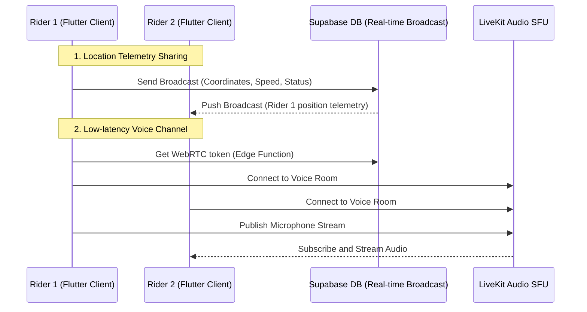

# Quantane Group Ride Feature Documentation

Welcome to the technical documentation for the **Group Ride** system. This feature transforms Quantane from a solo trip-tracking tool into a real-time, collaborative group coordination ecosystem.

---

## 1. Architectural Blueprint & Real-Time Flow



---

## 2. Technical Stack

*   **Database & Real-time Synchronization**: [Supabase Flutter](https://pub.dev/packages/supabase_flutter) (Database tables, RLS policy bypasses, Broadcast channels, Deno Edge Functions).
*   **Audio/Voice Communication**: [LiveKit Client](https://pub.dev/packages/livekit_client) (WebRTC SFU infrastructure, dynamic token generator, local audio track management).
*   **Maps & Markers**: [flutter_map](https://pub.dev/packages/flutter_map), [flutter_map_animations](https://pub.dev/packages/flutter_map_animations) (Animated markers, custom positioning overlays).
*   **Local Caching**: [shared_preferences](https://pub.dev/packages/shared_preferences) (Group state persistence).
*   **State Management**: [flutter_riverpod](https://pub.dev/packages/flutter_riverpod), [riverpod_annotation](https://pub.dev/packages/riverpod_annotation) (Reactive stream providers).

---

## 3. Database Schema Definitions

### `public.groups`
Stores active session headers:
```sql
CREATE TABLE public.groups (
    id UUID PRIMARY KEY DEFAULT gen_random_uuid(),
    name VARCHAR NOT NULL,
    owner_id VARCHAR NOT NULL,
    invite_code VARCHAR UNIQUE NOT NULL,
    is_private BOOLEAN DEFAULT false,
    encryption_salt VARCHAR,
    created_at TIMESTAMPTZ DEFAULT NOW(),
    deleted_at TIMESTAMPTZ
);
```

### `public.group_members`
Links users to groups and defines operational roles:
```sql
CREATE TABLE public.group_members (
    group_id UUID REFERENCES public.groups(id) ON DELETE CASCADE,
    user_id VARCHAR NOT NULL,
    role VARCHAR NOT NULL, -- 'owner' | 'member'
    joined_at TIMESTAMPTZ DEFAULT NOW(),
    PRIMARY KEY (group_id, user_id)
);
```

---

## 4. Supabase RLS Permissions configuration

To ensure frictionless anonymous access (using the `anonKey` client), configure the database with open-access policies:

```sql
-- 1. Enable RLS
ALTER TABLE groups ENABLE ROW LEVEL SECURITY;
ALTER TABLE group_members ENABLE ROW LEVEL SECURITY;

-- 2. Create Permissive Policies
CREATE POLICY "Enable all access for all users" ON groups FOR ALL USING (true) WITH CHECK (true);
CREATE POLICY "Enable all access for all users" ON group_members FOR ALL USING (true) WITH CHECK (true);
```

---

## 5. Voice Chat WebRTC Token Generator (Deno Edge Function)

WebRTC tokens are generated dynamically through a Supabase Edge Function to avoid exposing private LiveKit secrets on the client side.

*   **Location**: `supabase/functions/livekit-token-generator/index.ts`
*   **CLI Deployment**:
    ```bash
    supabase secrets set LIVEKIT_API_KEY=your_key LIVEKIT_API_SECRET=your_secret LIVEKIT_URL=your_url
    supabase functions deploy livekit-token-generator
    ```

---

## 6. Troubleshooting & Verification

### "getUserMedia(): DOMException, NotAllowedError"
*   **Cause**: The application does not have permission to access the microphone.
*   **Resolution**: Ensure `android.permission.RECORD_AUDIO` and `android.permission.MODIFY_AUDIO_SETTINGS` are declared in `AndroidManifest.xml`. The app automatically requests permission before entering the voice channel.

### "Could not find the table 'public.groups'"
*   **Cause**: The tables are not created or are in a different schema.
*   **Resolution**: Execute the SQL schemas in Section 3 inside your Supabase Database Editor.
