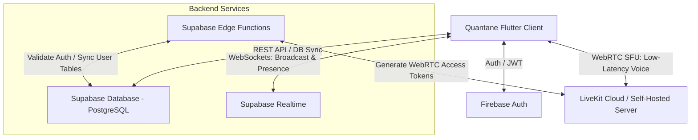
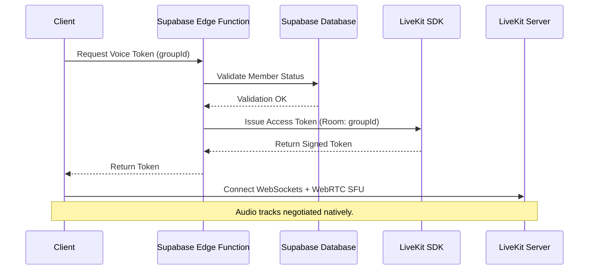
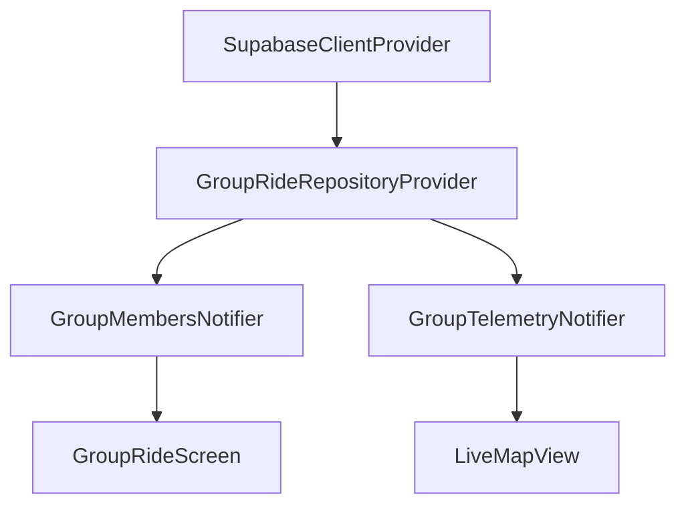

# Quantane "Group Ride" Production Architecture Proposal

This document outlines the production-grade engineering architecture and implementation plan for integrating the **Group Ride** collaborative experience into the Quantane application. 

---

## 1. Overall System Architecture

The Group Ride system is built as a hybrid, offline-first, real-time cooperative system. It bridges the existing Firebase Authentication layer with **Supabase (PostgreSQL + Realtime)** for group management, presence, and client-to-client broadcast telemetry. Low-latency, multi-participant voice communication is routed through **LiveKit**.



- **Database & Standard API**: Supabase (Postgres) for persistent, structured data (groups, members).
- **High-Frequency Telemetry & Presence**: Supabase Realtime WebSockets. Using the **Broadcast** protocol, clients stream live GPS location directly to other group members without writing to the database, preventing Postgres write-amplification.
- **Voice Communication**: LiveKit (WebRTC Selective Forwarding Unit). It manages low-latency audio rooms, Echo Cancellation, Voice Activity Detection (VAD), and handles connections natively on mobile platforms.
- **Auth Bridging**: The existing Firebase Auth JWT is validated securely on the backend (Supabase Edge Functions / Postgres) via public key cryptography (JWKS).

---

## 2. Frontend Architecture

The frontend is implemented using a feature-first architecture, isolated under `lib/features/group_ride`.

```
lib/features/group_ride/
├── data/
│   ├── datasources/
│   │   ├── group_remote_datasource.dart # Supabase client bindings
│   │   └── voice_remote_datasource.dart # LiveKit client bindings
│   └── repositories/
│       ├── group_repository_impl.dart
│       └── location_sharing_repository_impl.dart
├── domain/
│   ├── entities/
│   │   ├── group_ride.dart
│   │   ├── group_member.dart
│   │   └── rider_telemetry.dart
│   └── repositories/
│       ├── group_repository.dart
│       └── location_sharing_repository.dart
├── presentation/
│   ├── controllers/
│   │   ├── group_controller.dart
│   │   ├── voice_controller.dart
│   │   └── telemetry_controller.dart
│   └── screens/
│       ├── group_ride_screen.dart       # Main group tab
│       └── live_map_view.dart           # Collaborative map view
```

---

## 3. Backend Architecture

The backend consists of Supabase's managed Postgres, Go-based Realtime service, and Deno Edge Functions.

- **Deno Edge Functions**:
  - `auth-webhook`: Validates incoming Firebase JWTs and populates corresponding profiles in the Postgres database.
  - `livekit-token-generator`: Verifies if the authenticated user is currently an active member of the requested group's voice session, then issues a cryptographically signed LiveKit token.
- **Realtime Broker**: Supabase Realtime orchestrates WebSockets. Clients join a room named `group_ride:{group_id}`.
  - **Broadcast Channel**: Relays high-frequency coordinate JSON structures directly.
  - **Presence Channel**: Manages network statuses.

---

## 4. Database Schema

The database runs on PostgreSQL. Row Level Security (RLS) is enabled on all tables to enforce strict privacy between groups.

```sql
-- Enable UUID extension
CREATE EXTENSION IF NOT EXISTS "uuid-ossp";

-- Groups Table
CREATE TABLE groups (
    id UUID PRIMARY KEY DEFAULT uuid_generate_v4(),
    name VARCHAR(255) NOT NULL,
    owner_id VARCHAR(255) NOT NULL, -- Corresponds to Firebase Auth UID
    invite_code VARCHAR(64) UNIQUE NOT NULL,
    is_private BOOLEAN DEFAULT FALSE,
    encryption_salt VARCHAR(64) NOT NULL,
    created_at TIMESTAMP WITH TIME ZONE DEFAULT timezone('utc'::text, now()) NOT NULL,
    deleted_at TIMESTAMP WITH TIME ZONE
);

-- Group Members Table (Associative)
CREATE TABLE group_members (
    group_id UUID REFERENCES groups(id) ON DELETE CASCADE,
    user_id VARCHAR(255) NOT NULL,
    role VARCHAR(50) CHECK (role IN ('owner', 'admin', 'member')) DEFAULT 'member',
    joined_at TIMESTAMP WITH TIME ZONE DEFAULT timezone('utc'::text, now()) NOT NULL,
    PRIMARY KEY (group_id, user_id)
);

-- Indexes for performance
CREATE INDEX idx_group_members_user ON group_members(user_id);
CREATE INDEX idx_groups_invite_code ON groups(invite_code);

-- Enable RLS
ALTER TABLE groups ENABLE ROW LEVEL SECURITY;
ALTER TABLE group_members ENABLE ROW LEVEL SECURITY;

-- Row Level Security Policies
CREATE POLICY "Users can only view groups they belong to" 
    ON groups FOR SELECT 
    USING (
        EXISTS (
            SELECT 1 FROM group_members 
            WHERE group_members.group_id = groups.id AND group_members.user_id = auth.uid()
        )
    );
```

---

## 5. Voice Architecture

Real-time voice rooms are built on the **LiveKit** platform, achieving sub-100ms latency.



---

## 6. Live Location Architecture

Location tracking must be battery-efficient and visually smooth.

```
GPS Source (Geolocator) 
   │
   ▼
Distance Delta Filter ( > 5 meters or 3 seconds )
   │
   ▼
Supabase Realtime Broadcast (WebSocket Send)
   │
   ▼
Peer Client Receives Telemetry
   │
   ▼
Kalman / Linear Interpolation
   │
   ▼
Smooth Marker Animation (flutter_map_animations)
```

1. **Acquisition**: GPS coordinates are collected by the background task.
2. **Client-side Filtering**: Coordinates are discarded unless they pass a Distance Delta threshold ($\Delta d \ge 5\text{m}$) or $3\text{ seconds}$ have elapsed.
3. **Rendering**: Peer clients interpolate incoming coordinates. When a telemetry frame is received, an animation controller translates the marker coordinate linearly over $1000\text{ms}$ using `Tween<LatLng>` to prevent jumpy visuals.

---

## 7. Riverpod Architecture

The state system utilizes Riverpod Generator annotations to construct safe, cached providers.



- **`supabaseClientProvider`**: Singleton representing the network client.
- **`groupRideRepositoryProvider`**: Provides implementation contracts.
- **`groupMembersNotifierProvider`**: Manages membership states.
- **`groupTelemetryNotifierProvider`**: Subscribes to the broadcast channel and exposes updated telemetry states.

---

## 8. Package Comparison Matrix

| Package | Category | Maintenance | Native Integrations | Performance | Recommendation |
| :--- | :--- | :--- | :--- | :--- | :--- |
| **`livekit_client`** | Voice | Excellent | High (Android/iOS channels) | Outstanding (SFU) | **Recommended (Built for SFU scale)** |
| **`flutter_webrtc`** | Voice | Medium | Good | High | High overhead (requires custom signaling) |
| **`flutter_map_animations`** | Maps | High | flutter_map integration | Outstanding | **Recommended (Smooth marker movement)** |

---

## 9. Testing Strategy

```
               Testing Pyramids & Targets
               
            ▲  ┌───────────────────────┐
            │  │     Chaos Testing     │ (Network drops, latency)
           / \ ├───────────────────────┤
          /   \│     Load Testing      │ (Locust/k6 Socket floods)
         /     ├───────────────────────┤
        /       │   Integration Tests   │ (Patrol UI flows)
       /         ├───────────────────────┤
      /           │     Widget Tests      │ (Speedometer)
     /             ├───────────────────────┤
    /               │      Unit Tests       │ (DB schemas, calculators)
   ─────────────────┴───────────────────────┴───────────────
```

- **Unit**: Validates invite code cryptography, GPS distance filters, and model serializations.
- **Widget**: Tests speedometer updates.
- **Integration**: Simulates full group creation flows using the `patrol` framework.
- **Load Testing**: Uses k6 to flood Supabase Realtime channels with simulated coordinate updates.
