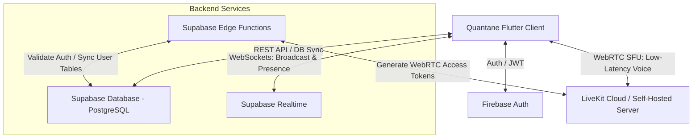
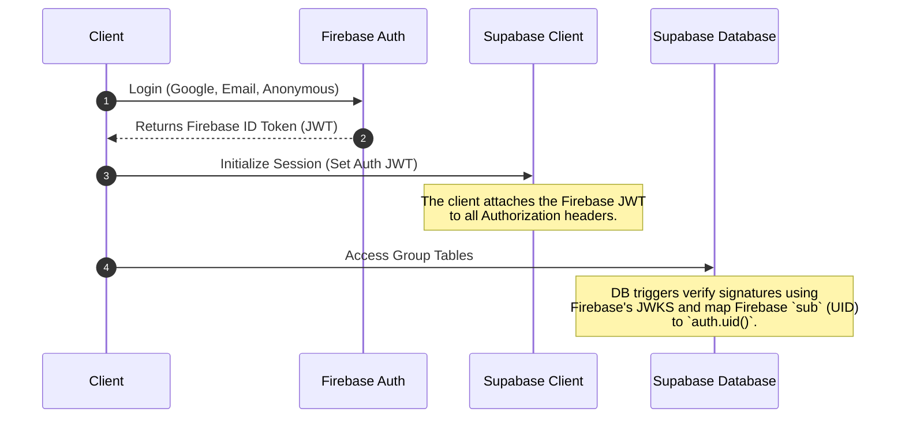
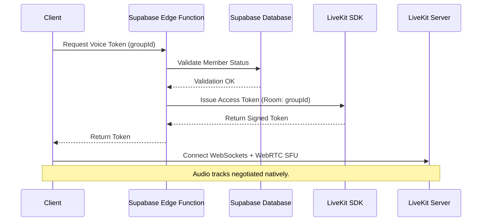
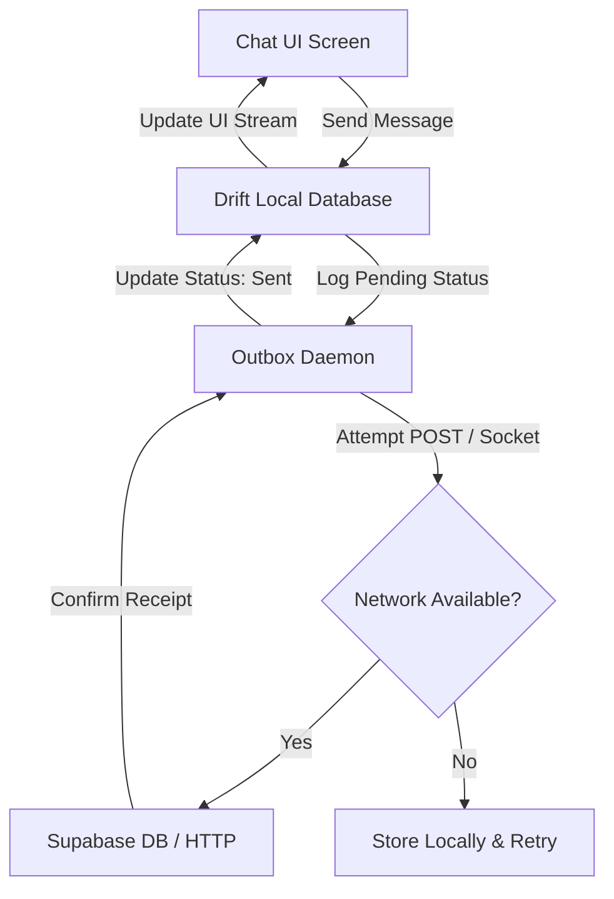
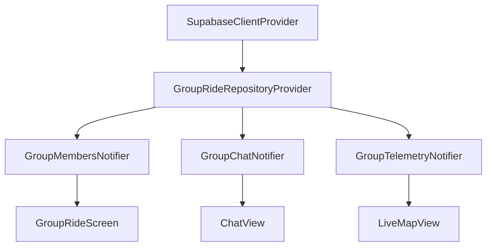

# Quantane "Group Ride" Production Architecture Proposal

This document outlines the production-grade engineering architecture and implementation plan for integrating the **Group Ride** collaborative experience into the Quantane application. 

---

## 1. Overall System Architecture

The Group Ride system is built as a hybrid, offline-first, real-time cooperative system. It bridges the existing Firebase Authentication layer with **Supabase (PostgreSQL + Realtime)** for group management, messaging, presence, and client-to-client broadcast telemetry. Low-latency, multi-participant voice communication is routed through **LiveKit**.



- **Database & Standard API**: Supabase (Postgres) for persistent, structured data (groups, members, chat history).
- **High-Frequency Telemetry & Presence**: Supabase Realtime WebSockets. Using the **Broadcast** protocol, clients stream live GPS location directly to other group members without writing to the database, preventing Postgres write-amplification.
- **Voice Communication**: LiveKit (WebRTC Selective Forwarding Unit). It manages low-latency audio rooms, Echo Cancellation, Voice Activity Detection (VAD), and handles connections natively on mobile platforms.
- **Auth Bridging**: The existing Firebase Auth JWT is validated securely on the backend (Supabase Edge Functions / Postgres) via public key cryptography (JWKS).

---

## 2. Frontend Architecture

The frontend is implemented using a feature-first architecture, isolated under `lib/features/group_ride`.

```
lib/features/group_ride/
├── data/
│   ├── database/
│   │   └── local_group_tables.drift     # Offline message queuing & local caching
│   ├── datasources/
│   │   ├── group_remote_datasource.dart # Supabase client bindings
│   │   └── voice_remote_datasource.dart # LiveKit client bindings
│   └── repositories/
│       ├── group_repository_impl.dart
│       ├── chat_repository_impl.dart
│       └── location_sharing_repository_impl.dart
├── domain/
│   ├── entities/
│   │   ├── group_ride.dart
│   │   ├── group_member.dart
│   │   ├── chat_message.dart
│   │   └── rider_telemetry.dart
│   └── repositories/
│       ├── group_repository.dart
│       ├── chat_repository.dart
│       └── location_sharing_repository.dart
├── presentation/
│   ├── controllers/
│   │   ├── group_controller.dart
│   │   ├── chat_controller.dart
│   │   ├── voice_controller.dart
│   │   └── telemetry_controller.dart
│   └── screens/
│       ├── group_ride_screen.dart       # Main group tab
│       ├── chat_view.dart               # Message board UI
│       └── live_map_view.dart           # Collaborative map view
```

### Key Design Principles:
1. **Repository Pattern**: Hides real-time network details (WebSockets, WebRTC) behind simple reactive Streams.
2. **State Decoupling**: State management is handled using Riverpod annotators, separating the presentation layer from network connections.
3. **Local Caching**: Drift handles message outbox logging for offline message processing, while Shared Preferences caches metadata.

---

## 3. Backend Architecture

The backend consists of Supabase's managed Postgres, Go-based Realtime service, and Deno Edge Functions.

- **Deno Edge Functions**:
  - `auth-webhook`: Validates incoming Firebase JWTs and populates corresponding profiles in the Postgres database.
  - `livekit-token-generator`: Verifies if the authenticated user is currently an active member of the requested group's voice session, then issues a cryptographically signed LiveKit token.
  - `group-invitation-handler`: Handles generation and decryption of encrypted group invite codes.
- **Realtime Broker**: Supabase Realtime orchestrates WebSockets. Clients join a room named `group_ride:{group_id}`.
  - **Broadcast Channel**: Relays high-frequency coordinate JSON structures directly.
  - **Presence Channel**: Manages network statuses and typing indicators.

---

## 4. Database Schema

The database runs on PostgreSQL. Row Level Security (RLS) is enabled on all tables to enforce strict privacy between groups.

```sql
-- Enable UUID extension
CREATE EXTENSION IF NOT EXISTS "uuid-ossp";

-- Groups Table
CREATE TABLE groups (
    id UUID PRIMARY KEY DEFAULT uuid_generate_v4(),
    name VARCHAR(255) NOT NULL,
    owner_id VARCHAR(255) NOT NULL, -- Corresponds to Firebase Auth UID
    invite_code VARCHAR(64) UNIQUE NOT NULL,
    is_private BOOLEAN DEFAULT FALSE,
    encryption_salt VARCHAR(64) NOT NULL,
    created_at TIMESTAMP WITH TIME ZONE DEFAULT timezone('utc'::text, now()) NOT NULL,
    deleted_at TIMESTAMP WITH TIME ZONE
);

-- Group Members Table (Associative)
CREATE TABLE group_members (
    group_id UUID REFERENCES groups(id) ON DELETE CASCADE,
    user_id VARCHAR(255) NOT NULL,
    role VARCHAR(50) CHECK (role IN ('owner', 'admin', 'member')) DEFAULT 'member',
    joined_at TIMESTAMP WITH TIME ZONE DEFAULT timezone('utc'::text, now()) NOT NULL,
    PRIMARY KEY (group_id, user_id)
);

-- Chat Messages Table
CREATE TABLE group_messages (
    id UUID PRIMARY KEY DEFAULT uuid_generate_v4(),
    group_id UUID REFERENCES groups(id) ON DELETE CASCADE,
    sender_id VARCHAR(255) NOT NULL,
    content TEXT NOT NULL,
    message_type VARCHAR(50) CHECK (message_type IN ('text', 'image', 'file')) DEFAULT 'text',
    created_at TIMESTAMP WITH TIME ZONE DEFAULT timezone('utc'::text, now()) NOT NULL,
    offline_id UUID UNIQUE NOT NULL
);

-- Message Receipts Table (For delivery & read indicators)
CREATE TABLE message_receipts (
    message_id UUID REFERENCES group_messages(id) ON DELETE CASCADE,
    user_id VARCHAR(255) NOT NULL,
    status VARCHAR(50) CHECK (status IN ('delivered', 'read')) NOT NULL,
    updated_at TIMESTAMP WITH TIME ZONE DEFAULT timezone('utc'::text, now()) NOT NULL,
    PRIMARY KEY (message_id, user_id)
);

-- Indexes for performance
CREATE INDEX idx_group_members_user ON group_members(user_id);
CREATE INDEX idx_group_messages_group ON group_messages(group_id, created_at DESC);
CREATE INDEX idx_groups_invite_code ON groups(invite_code);

-- Enable RLS
ALTER TABLE groups ENABLE ROW LEVEL SECURITY;
ALTER TABLE group_members ENABLE ROW LEVEL SECURITY;
ALTER TABLE group_messages ENABLE ROW LEVEL SECURITY;
ALTER TABLE message_receipts ENABLE ROW LEVEL SECURITY;

-- Row Level Security Policies
CREATE POLICY "Users can only view groups they belong to" 
    ON groups FOR SELECT 
    USING (
        EXISTS (
            SELECT 1 FROM group_members 
            WHERE group_members.group_id = groups.id AND group_members.user_id = auth.uid()
        )
    );

CREATE POLICY "Members can view messages inside their group" 
    ON group_messages FOR SELECT 
    USING (
        EXISTS (
            SELECT 1 FROM group_members 
            WHERE group_members.group_id = group_messages.group_id AND group_members.user_id = auth.uid()
        )
    );

CREATE POLICY "Members can insert messages inside their group" 
    ON group_messages FOR INSERT 
    WITH CHECK (
        EXISTS (
            SELECT 1 FROM group_members 
            WHERE group_members.group_id = group_messages.group_id AND group_members.user_id = auth.uid()
        ) AND sender_id = auth.uid()
    );
```

---

## 5. Authentication Flow

Since the existing client uses Firebase Auth, we map Firebase identity credentials securely to our real-time database.



1. **Token Verification**: Supabase is configured with custom JWT verification hooks or verifies the Firebase ID Token directly using Deno Edge Functions caching Google's JWK sets (`https://www.googleapis.com/robot/v1/metadata/x509/securetoken@system.gserviceaccount.com`).
2. **Offline Handling**: If token verification fails due to temporary network issues, local Drift DB cached records allow readable access to historical group structures.

---

## 6. Group Lifecycle

Group flows are designed around secure cryptography to restrict membership.

```
                  ┌──────────────────────┐
                  │       Create         │
                  └──────────┬───────────┘
                             │ Generates random Group ID & Salt
                             ▼
                  ┌──────────────────────┐
                  │    Invite Code       │◄─────────── Encrypted invite hash
                  └──────────┬───────────┘
                             │
            ┌────────────────┴────────────────┐
            ▼                                 ▼
   ┌─────────────────┐               ┌─────────────────┐
   │  Join (Public)  │               │ Join (Private)  │
   └────────┬────────┘               └────────┬────────┘
            │ Direct check                    │ Validates key/password
            ▼                                 ▼
   ┌───────────────────────────────────────────────────┐
   │                 Active Membership                 │
   └────────────────────────┬──────────────────────────┘
                            │
            ┌───────────────┼───────────────┐
            ▼               ▼               ▼
     ┌────────────┐   ┌────────────┐   ┌────────────┐
     │ Leave Group│   │Kick (Admin)│   │Owner Delete│
     └────────────┘   └────────────┘   └────────────┘
```

- **Create**: A user generates a group. An `encryption_salt` is created.
- **Invite Codes**: Private groups generate invite codes using:
  $$\text{Code} = \text{Base64}(\text{Group UUID} \mathbin{\Vert} \text{HMAC}_{\text{Salt}}(\text{Expiry Timestamp}))$$
  When a user enters a code, the backend verifies the signature, checking for expiration and modification.
- **Roles**:
  - **Owner**: Complete authority. Can delete group, change roles, assign Admins, or kick users.
  - **Admin**: Can kick standard members, update metadata, and control voice session channels.
  - **Member**: Standard read/write access.
- **Deletion**: Soft deletes groups (sets `deleted_at`). This triggers a database function that removes related voice tokens and disconnects WebSocket connections.

---

## 7. Voice Architecture

Real-time voice rooms are built on the **LiveKit** platform, achieving sub-100ms latency.



### Audio Pipeline Configuration
- **LiveKit Client SDK**: Integrating `livekit_client` for Flutter.
- **Audio Options**:
  - `echoCancellation: true` (Hardware-assisted API on iOS/Android).
  - `noiseSuppression: true` (WebRTC voice filters).
  - `voiceActivityDetection: true` (Lowers bandwidth utilization).
- **Background Mode**: Incorporates `flutter_foreground_task` to prevent the OS from terminating audio streams when the app is backgrounded.
- **Bluetooth/Routing**: Uses `audio_session` to automatically switch between speakers, wired headsets, and Bluetooth profiles (HSP/A2DP).

---

## 8. Text Chat Architecture

Offline-first synchronization guarantees that message delivery is reliable even under poor riding network conditions.



- **Local Storage**: The local database maintains a matching table `local_messages`.
- **Receipt Protocol**:
  - `pending`: Local database entry only.
  - `sent`: Server has acknowledged receipt.
  - `delivered`: WebSocket event received indicating the recipient's background listener wrote the payload.
  - `read`: Receiver triggers an explicit client event on opening the chat window.

---

## 9. Live Location Architecture

Location tracking must be battery-efficient and visually smooth.

```
GPS Source (Geolocator) 
   │
   ▼
Distance Delta Filter ( > 5 meters or 3 seconds )
   │
   ▼
Supabase Realtime Broadcast (WebSocket Send)
   │
   ▼
Peer Client Receives Telemetry
   │
   ▼
Kalman / Linear Interpolation
   │
   ▼
Smooth Marker Animation (flutter_map_animations)
```

1. **Acquisition**: GPS coordinates are collected by the background task.
2. **Client-side Filtering**: Coordinates are discarded unless they pass a Distance Delta threshold ($\Delta d \ge 5\text{m}$) or $3\text{ seconds}$ have elapsed, reducing redundant socket transmissions.
3. **Low-Impact Transmission**: Telemetry is serialized as a compact JSON map:
   ```json
   {
     "rider_id": "usr_998",
     "lat": 12.9716,
     "lng": 77.5946,
     "spd": 42.5,
     "hdg": 184.2,
     "bat": 84,
     "t": 1783353000
   }
   ```
4. **Rendering**: Peer clients interpolate incoming coordinates. When a telemetry frame is received, an animation controller translates the marker coordinate linearly over $1000\text{ms}$ using `Tween<LatLng>` to prevent jumpy visuals.
5. **Google Maps Navigation**: Tapping a participant's profile extracts their active coordinates and invokes:
   ```dart
   final url = 'google.navigation:q=${telemetry.lat},${telemetry.lng}';
   if (await canLaunchUrlString(url)) {
     await launchUrlString(url);
   }
   ```

---

## 10. Presence System

Ensures real-time visibility of who is active in the group.

- **Supabase Presence**: Utilizes CRDT-based states. Clients periodically send heartbeats.
- **Online/Offline Transitions**:
  - **Graceful**: The client sends a `leave` payload on exiting the channel.
  - **Ungraceful**: If a socket disconnects without warning (e.g. signal loss), the server triggers a timeout event after $15\text{ seconds}$ of missing heartbeats, broadcasting the offline transition.
- **Ghost Prevention**: Active voice users who go offline are automatically disconnected from the room via server-side session cleanup hooks.

---

## 11. WebSocket/Event Architecture

The real-time communications channel is structured using JSON schemas.

### Outgoing Client Message Format
```json
{
  "event": "location_update",
  "topic": "room:group_ride_123",
  "payload": {
    "lat": 12.9716,
    "lng": 77.5946,
    "speed": 45.2,
    "heading": 180.0,
    "battery": 82,
    "accuracy": 4.2
  },
  "ref": "msg_ref_001"
}
```

### Server Dispatch Format
```json
{
  "event": "location_update",
  "topic": "room:group_ride_123",
  "payload": {
    "user_id": "usr_abc123",
    "lat": 12.9716,
    "lng": 77.5946,
    "speed": 45.2,
    "heading": 180.0,
    "battery": 82,
    "accuracy": 4.2,
    "timestamp": 1783353010
  }
}
```

---

## 12. API Design

### REST API
- `POST /api/v1/groups`: Creates a new group.
- `POST /api/v1/groups/join`: Joins a group via encrypted invite code.
- `DELETE /api/v1/groups/{id}`: Deletes group.
- `POST /api/v1/voice/token`: Returns a LiveKit audio room authorization token.

### WebSocket Channels (Supabase Realtime)
- Topic: `realtime:group_ride:{groupId}`
- Events:
  - `location_update`: Broadcasts telemetry payload.
  - `typing_indicator`: Broadcasts `{"user": "uid", "isTyping": true}`.
  - `presence_diff`: Automatically generated on user join/leave.

---

## 13. Data Models

```dart
import 'package:freezed_annotation/freezed_annotation.dart';

part 'group_models.freezed.dart';
part 'group_models.g.dart';

@freezed
class GroupRideSession with _$GroupRideSession {
  const factory GroupRideSession({
    required String id,
    required String name,
    required String ownerId,
    required String inviteCode,
    required List<GroupMember> members,
    @Default(false) bool voiceSessionActive,
    DateTime? createdAt,
  }) = _GroupRideSession;

  factory GroupRideSession.fromJson(Map<String, dynamic> json) =>
      _$GroupRideSessionFromJson(json);
}

@freezed
class GroupMember with _$GroupMember {
  const factory GroupMember({
    required String userId,
    required String displayName,
    required String role,
    required bool isOnline,
    required String avatarUrl,
  }) = _GroupMember;

  factory GroupMember.fromJson(Map<String, dynamic> json) =>
      _$GroupMemberFromJson(json);
}

@freezed
class RiderTelemetry with _$RiderTelemetry {
  const factory RiderTelemetry({
    required String riderId,
    required double latitude,
    required double longitude,
    required double speed,
    required double heading,
    required double accuracy,
    required int batteryLevel,
    required String status, // moving | stationary | offline
    required int timestamp,
  }) = _RiderTelemetry;

  factory RiderTelemetry.fromJson(Map<String, dynamic> json) =>
      _$RiderTelemetryFromJson(json);
}
```

---

## 14. Riverpod Architecture

The state system utilizes Riverpod Generator annotations to construct safe, cached providers.



- **`supabaseClientProvider`**: Singleton representing the network client.
- **`groupRideRepositoryProvider`**: Provides implementation contracts.
- **`groupMembersNotifierProvider`**: Manages membership states.
- **`groupChatNotifierProvider`**: Exposes message logs and sync outbox tasks.
- **`groupTelemetryNotifierProvider`**: Subscribes to the broadcast channel and exposes updated telemetry states.

---

## 15. Background Execution Strategy

Riding apps require robust background configurations to avoid platform resource restrictions.

- **Service Lifespans**: Under Android, we register a Foreground Service with an ongoing notification using `flutter_foreground_task`. Under iOS, we activate `location` background mode options.
- **OS Exemption**:
  - **Android**: Request battery optimization exemption (`ACTION_REQUEST_IGNORE_BATTERY_OPTIMIZATIONS`).
  - **iOS**: Set `pausesLocationUpdatesAutomatically = false` and `showsBackgroundLocationIndicator = true` on the location tracker.
- **Crash Recovery**: If the OS terminates the main thread, the foreground service writes coordinates to a local sqlite buffer, to be uploaded once the app is reopened.

---

## 16. Offline Synchronization Strategy

The synchronization logic behaves as a finite state machine:

```
            Offline Message Outbox Flow
            
   ┌────────────────────────────────────────┐
   │         Store Message locally          │
   │           (status = pending)           │
   └───────────────────┬────────────────────┘
                       │
                       ▼
            ┌───────────────────┐
            │   Network Check   │
            └──────────┬────────┘
                       │
             ┌─────────┴─────────┐
             ▼                   ▼
        [Connected]        [Disconnected]
             │                   │
             ▼                   ▼
   ┌───────────────────┐   ┌─────────────┐
   │  Upload Message   │   │ Queue Retry │
   └─────────┬─────────┘   └─────────────┘
             │
             ▼
   ┌───────────────────┐
   │Update Local Status│
   │  (status = sent)  │
   └───────────────────┘
```

1. **Write Local**: All outgoing messages are written directly to local Drift tables.
2. **Connectivity Dispatch**: When `connectivity_plus` signals a transition to online state, the Sync Worker pulls pending messages, dispatching them sequentially.
3. **Idempotency**: All records feature a client-generated `offline_id` UUID. If the server receives duplicates during reconnection loops, it ignores them based on unique constraints on the DB column.

---

## 17. Security Model

Security measures prevent unauthorized access and data tampering.

- **Authorization**: Row Level Security (RLS) ensures members can only write to channels they belong to.
- **Data in Transit**: WSS (WebSocket Secure) and HTTPS connections enforce TLS 1.3.
- **Replay Protection**: Live location packages require monotonic timestamps ($t_{\text{msg}} > t_{\text{last\_known}}$). Late packages are dropped.
- **GPS Spoofing Filtering**: Location points are validated mathematically. If $\Delta d / \Delta t > 250\text{ km/h}$, the coordinate is discarded as a suspected spoofing attempt.

---

## 18. Scalability Plan

The target scale is 10,000+ concurrent riders.

- **PostgreSQL Optimization**: Read-heavy operations are served via replica nodes. Indices prevent table scans during messaging.
- **Realtime Optimization**: Because location feeds are streamed via WebSocket Broadcast instead of database writes, DB load is kept to a minimum.
- **LiveKit Scalability**: LiveKit distributes audio packet routing via distributed SFU nodes. A Redis backplane manages room allocations.

---

## 19. Cost Analysis

Infrastructure costs are optimized to take advantage of free tiers first.

### Free Tier Assets
- **Supabase Cloud**: 
  - Free database (500MB storage).
  - 50,000 Monthly Active Users (Auth).
  - Realtime: 200 concurrent connections.
- **LiveKit Cloud**:
  - 50,000 monthly voice minutes.
- **Fly.io (Web Hosting)**:
  - Generous free tier for light Deno/Go app instances.

### Cost Scaling Matrix (USD / Month)

| Concurrent Riders | Supabase DB Size / Tier | Realtime Connections Cost | LiveKit Voice Minutes Cost | Total Est. Cost |
| :--- | :--- | :--- | :--- | :--- |
| **100** | Free ($0) | Included ($0) | Included ($0) | **$0.00** |
| **1,000** | Pro Tier ($25) | Included ($0) | 1,000,000 mins (~$99) | **$124.00** |
| **10,000** | Pro Tier + Storage ($40) | Custom plan ($30) | 10,000,000 mins (~$990)| **$1,060.00** |

---

## 20. Hosting Recommendation

To balance performance with budget restrictions, we recommend the following deployment model:

```
                  Quantane Deployment Setup
                  
      Client Devices ◄──────────┐
           │                     │ (Auth Validation)
           ▼                     ▼
┌──────────────────────┐  ┌──────────────┐
│  LiveKit Voice Room  │  │   Firebase   │ (Existing Accounts)
│ (LiveKit Cloud Free) │  │  (Auth/Auth) │
└──────────────────────┘  └──────────────┘
           ▲
           │ (DB Access)
           ▼
┌──────────────────────┐
│  Supabase Sandbox    │ (PostgreSQL, Broadcast,
│  (Supabase Cloud)    │  Edge Functions)
└──────────────────────┘
```

- **Authentication**: Firebase Authentication (maintained).
- **Core Engine & Data Storage**: Supabase Cloud.
- **Voice System**: LiveKit Cloud (Free tier) transitioning to a self-hosted LiveKit server on a dedicated Hetzner VPS ($15/month) when usage exceeds 50,000 monthly minutes.

---

## 21. Package Comparison Matrix

| Package | Category | Maintenance | Native Integrations | Performance | Recommendation |
| :--- | :--- | :--- | :--- | :--- | :--- |
| **`livekit_client`** | Voice | Excellent | High (Android/iOS channels) | Outstanding (SFU) | **Recommended (Built for SFU scale)** |
| **`flutter_webrtc`** | Voice | Medium | Good | High | High overhead (requires custom signaling) |
| **`flutter_chat_ui`**| Chat | High | Universal | Excellent | **Recommended (Highly customizable)** |
| **`dash_chat_2`**    | Chat | Medium | Universal | Good | Alternative |
| **`flutter_map_animations`** | Maps | High | flutter_map integration | Outstanding | **Recommended (Smooth marker movement)** |

---

## 22. Deployment Strategy

We utilize a zero-downtime deployment strategy.

- **Supabase Migration**: Schema modifications are written as migrations and validated locally in Docker before being pushed to production.
- **Edge Deployment**: Supabase Edge Functions are deployed globally to regional CDN endpoints using GitHub Actions.
- **Self-Hosted LiveKit (VPS)**: Handled via Docker Compose on an Ubuntu node configured with Let's Encrypt for automatic TLS generation.

---

## 23. CI/CD Recommendations

The deployment pipeline is built using GitHub Actions.

- **Frontend Target**:
  - `lint`: Verifies styling rules with `very_good_analysis`.
  - `test`: Executes Flutter unit and widget tests.
  - `build`: Generates Android app bundles (AAB) and iOS archive targets.
- **Backend Target**:
  - Validates Edge Functions using standard Deno lints.
  - Generates types from Postgres to verify Schema integrity.

---

## 24. Monitoring and Observability

Ensures real-time visibility into the system's operational health.

- **Sentry Integration**: Integrated into both the Flutter client and Edge Functions to catch unhandled errors.
- **LiveKit Dashboard**: Monitors voice call metrics (RTT, packet loss, bitrates).
- **Supabase Console**: Analyzes CPU loads, connection pools, and real-time socket connections.

---

## 25. Logging Strategy

Structured logs provide clear diagnostic data when troubleshooting issues.

- **Backend Logging**: Edge functions export structured JSON logs to standard output, which are aggregated:
  ```json
  {"level":"info","event":"voice_token_issued","user_id":"usr_123","group_id":"grp_456","timestamp":1783353055}
  ```
- **Frontend Logging**: Logs are filtered based on environment builds. Production releases strip detailed GPS trace coordinates to ensure user privacy.

---

## 26. Analytics

Usage analytics track engagement without compromising privacy.

- **Tracked Indicators**:
  - Number of group rides created.
  - Average ride duration.
  - Peak concurrent voice participants.
  - Network drop-off frequencies.

---

## 27. Crash Reporting

- **Sentry SDK**: Tracks application crashes.
- **Breadcrumbs**: We record network state transitions (Wi-Fi to mobile), location access permissions, and WebSocket reconnect attempts to reconstruct crash contexts.

---

## 28. Testing Strategy

```
               Testing Pyramids & Targets
               
            ▲  ┌───────────────────────┐
            │  │     Chaos Testing     │ (Network drops, latency)
           / \ ├───────────────────────┤
          /   \│     Load Testing      │ (Locust/k6 Socket floods)
         /     ├───────────────────────┤
        /       │   Integration Tests   │ (Patrol UI flows)
       /         ├───────────────────────┤
      /           │     Widget Tests      │ (Chat renders, Speedometer)
     /             ├───────────────────────┤
    /               │      Unit Tests       │ (DB schemas, calculators)
   ─────────────────┴───────────────────────┴───────────────
```

- **Unit**: Validates invite code cryptography, GPS distance filters, and model serializations.
- **Widget**: Tests chat UI renders and speedometer updates.
- **Integration**: Simulates full group creation and message posting flows using the `patrol` framework.
- **Load Testing**: Uses k6 to flood Supabase Realtime channels with simulated coordinate updates.
- **Chaos Testing**: Uses network proxies on physical test hardware to verify client recovery when connections drop.

---

## 29. Disaster Recovery

- **Database Backup**: Standard daily logical backups, with Point-In-Time Recovery (PITR) active in production.
- **Failover Plan**: In the event of a Supabase regional outage, the Flutter client gracefully falls back to offline tracking mode. Data is stored locally and queued for upload once connection is restored.
- **Voice System Failover**: If LiveKit Cloud fails, edge settings redirect client connections to backup self-hosted VPS nodes.

---

## 30. Future Roadmap

### Phase 1: Local Foundation & DB Migration (Weeks 1-2)
- Configure Drift tables for local group data and message outbox structures.
- Integrate the Supabase client and implement the Firebase JWT token mapping backend functions.

### Phase 2: Group Management & Text Chat (Weeks 3-4)
- Build group creation, invite handling, and member roles UI.
- Implement the offline-first text chat flow with delivery/read receipts.

### Phase 3: Location Telemetry & Map Views (Weeks 5-6)
- Connect GPS background services with Supabase Realtime Broadcast.
- Build the collaborative map UI, implementing smooth marker interpolations and cluster features.

### Phase 4: WebRTC Voice Integration (Weeks 7-8)
- Integrate the LiveKit SDK, implementing noise suppression and background audio routing.
- Set up the LiveKit token authentication services.

### Phase 5: Verification & Production Release (Weeks 9-10)
- Perform load, chaos, and integration testing.
- Launch the production server instances and deploy the client builds.
