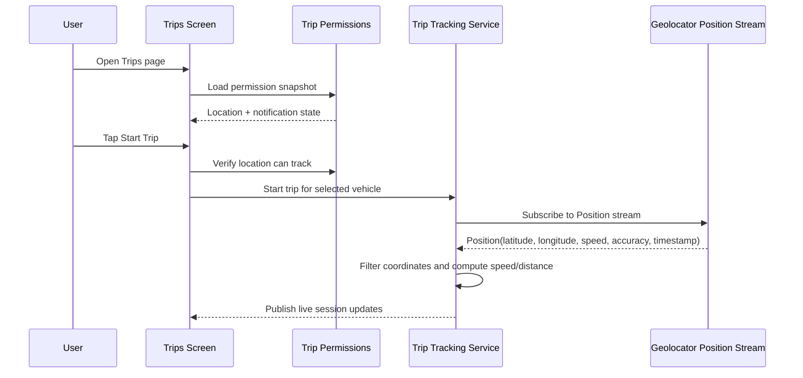

# Trips Page GPS and Coordinate Flow

This document describes how the Trips page works in Quantane, with emphasis on how GPS coordinates are collected, filtered, and turned into trip data.

## Purpose of the Trips Page

The Trips page is the entry point for trip tracking. It has three main jobs:

1. Show the current permission state for location and notifications.
2. Let the user select the active vehicle and start or resume a trip.
3. Show trip history, live trip status, and summary metrics for the selected vehicle.

The page is built in [lib/features/trips/trips_screen.dart](../lib/features/trips/trips_screen.dart). Trip orchestration lives in [lib/features/trips/trip_providers.dart](../lib/features/trips/trip_providers.dart) and GPS processing lives in [lib/features/trips/trip_tracking_service.dart](../lib/features/trips/trip_tracking_service.dart) and [lib/features/trips/trip_session_models.dart](../lib/features/trips/trip_session_models.dart).

## High-Level Flow

When the Trips page opens:

1. The app reads the active vehicle from `activeVehicleProvider`.
2. The app reads the current permission snapshot from `tripPermissionsProvider`.
3. The app reads the trip history stream for the active vehicle from `tripHistoryProvider`.
4. The UI shows a permission banner if location is blocked or notifications need attention.
5. The main trip card summarizes trip distance, duration, speed, and count.
6. The floating action button starts a trip only when location access is ready, unless a live session is already running.

## Permission Gatekeeping

Permissions are modeled in [lib/features/trips/trip_permissions.dart](../lib/features/trips/trip_permissions.dart).

The permission controller checks two separate things:

1. Location availability.
2. Notification availability.

### Location

Location is considered usable only when:

1. Location services are enabled on the device.
2. `Geolocator.checkPermission()` returns `always` or `whileInUse`.

The Trips page treats the following states as blocking:

1. `denied`
2. `permanentlyDenied`
3. `restricted`
4. `serviceDisabled`
5. `unavailable`

The permission banner then shows a recovery action such as:

1. Allow location.
2. Open location settings.
3. Open app settings.

### Notifications

Notifications are checked through `FlutterForegroundTask.checkNotificationPermission()`.

Notification permission is advisory rather than blocking. If notifications are off, the page shows a warning card, but the user can still track a trip as long as location is available.

## GPS and Coordinate Capture

Actual GPS processing happens inside the foreground task handler in [lib/features/trips/trip_tracking_service.dart](../lib/features/trips/trip_tracking_service.dart).

The service subscribes to `Geolocator.getPositionStream(...)` with:

1. `LocationAccuracy.high`
2. `distanceFilter: 1`

That means the app receives a steady stream of `Position` updates when the device is moving or producing new location data.

Each `Position` contains the raw coordinate and sensor data used by the trip logic:

1. `latitude`
2. `longitude`
3. `timestamp`
4. `accuracy`
5. `speed`
6. `speedAccuracy`
7. `heading`
8. `isMocked`

## How Coordinates Are Turned Into Trip Data

Each location update is fed into `TripMetricsCalculator.update(...)` in [lib/features/trips/trip_session_models.dart](../lib/features/trips/trip_session_models.dart).

The calculator uses the coordinate stream to build trip state and applies several filters before accepting a point.

### 1. Accuracy filter

The first check rejects noisy readings:

1. If `position.accuracy > 30m`, the point is ignored.

This prevents poor GPS fixes from polluting speed and distance.

### 2. Time ordering filter

If the new timestamp is older than the previous accepted point, the update is ignored.

This keeps the trip history in chronological order.

### 3. Derived distance and derived speed

When there is a previous accepted coordinate, the calculator uses `Geolocator.distanceBetween(...)` to measure how far the new point moved.

From that distance and the elapsed time between points, it computes a derived speed:

$$
\text{speed} = \frac{\text{distanceMeters}}{\text{elapsedSeconds}} \times 3.6
$$

That gives speed in km/h.

The calculator only accepts movement when:

1. The step is at least `3m`.
2. The derived speed is not more than `250 km/h`.

### 4. Reported speed validation

The GPS `Position.speed` value is not trusted by itself because it can remain nonzero while the device is idle.

The implementation compares:

1. Reported speed from the GPS sensor.
2. Derived speed from the coordinate delta.
3. `speedAccuracy` from the sensor.
4. `isMocked` for fake location detection.

The estimator only accepts speed when there is real positional movement. If the reading looks idle, inconsistent, mocked, or too noisy, the speed is forced back to `0`.

This is what prevents the old behavior where the UI could show a stuck idle speed such as `9 km/h` even when the trip was actually stationary.

## What Gets Stored in Trip State

The Trip state object stores:

1. Session metadata such as `sessionId`, `vehicleId`, `startTime`, `updatedAt`, and `endTime`.
2. Live metrics such as `currentSpeed`, `maxSpeed`, and `distance`.
3. The full coordinate trail as `TripPoint` entries.

Each `TripPoint` stores:

1. Latitude.
2. Longitude.
3. Timestamp.
4. Speed in km/h.
5. Accuracy in meters.
6. Heading, when available.

This gives the app both live telemetry and a persisted history of exactly how the trip moved.

## Trip Start and Lifecycle

Trip lifecycle is controlled by [lib/features/trips/trip_providers.dart](../lib/features/trips/trip_providers.dart) and [lib/features/trips/trip_tracking_service.dart](../lib/features/trips/trip_tracking_service.dart).

### Starting a trip

When the user taps Start Trip:

1. The UI checks that a vehicle is selected.
2. The app checks that the location permission snapshot allows trip tracking.
3. The trip tracking service initializes foreground-task support.
4. A new session is created with zero speed, zero distance, and an empty coordinate list.
5. The session is saved locally.
6. The foreground service starts and begins listening to GPS updates.

### While the trip is active

As new coordinates arrive:

1. The new `Position` is filtered.
2. Valid updates refresh current speed and max speed.
3. Valid movement increments total distance.
4. The updated trip state is written back to storage.
5. The live notification text updates with the current speed.

### Stopping a trip

When a trip is stopped:

1. The active session is finalized with an `endTime`.
2. The final trip is converted into a saved trip record.
3. The foreground service is stopped.
4. The persisted active session is cleared.

## How the Trips Page Shows the Data

The Trips screen shows three layers of information:

1. Permissions banner.
2. Summary hero card for the active vehicle.
3. Recent trips list.

### Permission banner

If location is blocked, the page shows a prominent card explaining why trip tracking cannot start and what action to take.

If notifications are disabled, the page shows a secondary advisory card.

### Summary card

The hero card summarizes:

1. Total distance.
2. Total duration.
3. Number of completed trips.
4. Average speed.

It also includes the vehicle selector chip so the user can switch the active vehicle without leaving the Trips page.

### Recent trips

The recent trips list is driven by the selected vehicle’s trip history stream.

If no vehicle is selected, the list area explains that a vehicle must be selected first.

If there are no trips yet, it shows a guidance state telling the user to start a trip from this page.

## Foreground Service and Live Updates

The trip tracking service uses `flutter_foreground_task` to keep tracking alive while the app is in the background.

The foreground service is responsible for:

1. Holding the active trip session.
2. Receiving GPS positions in the background task.
3. Updating the notification with trip speed.
4. Finalizing the session when the user stops the trip.

The service is also wired so the app can restore a persisted session if tracking was interrupted.

## Important Coordinate Rules

These are the key rules used by the GPS logic:

1. Ignore low-accuracy points above `30m`.
2. Ignore updates that do not move at least `3m`.
3. Ignore impossible movement above `250 km/h`.
4. Prefer coordinate-derived movement over raw GPS speed when GPS speed looks unreliable.
5. Force speed to `0` when the reading is mocked or the device appears idle.

## Summary Sequence

## Notes for Documentation

If you are documenting this page for other developers, the most important point is that the app does not trust raw GPS speed alone. It treats coordinates as the primary source of truth and uses sensor speed only as a secondary signal after validation.
