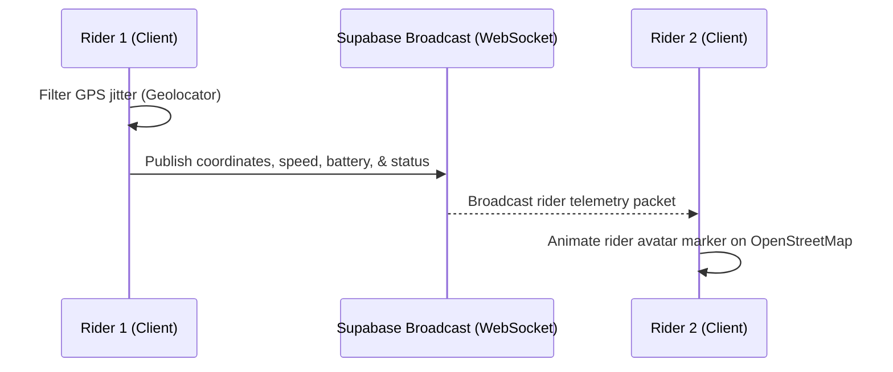

# Quantane — Premium Vehicle Analytics & Collaborative Group Ride

Quantane is a high-performance, offline-first vehicle analytics and real-time collaborative riding platform built with Flutter. Optimized for high concurrency, low latency, and modular scalability, it combines local-first fuel intelligence dashboards with real-time GPS telemetry broadcasting, live Map views, and WebRTC voice communication.

The application follows a **dark-first premium fintech aesthetic** utilizing glassmorphic UI layers, smooth marker animations, and robust background services.

---

## 🧭 System Architecture & Design Patterns

Quantane is designed using **Feature-First Clean Architecture**, separating code into distinct layers (Data, Domain, Presentation) to enforce strict dependency injection, predictability, and complete unit-test coverage.

```
lib/
├── core/                         # Router configurations, Theme engine, Core utilities
├── data/                         # Drift SQLite database, shared repositories
├── domain/                       # Core Entities, shared models
└── features/                     # Feature-specific modules
    ├── auth/                     # Firebase Auth bridge
    ├── home/                     # Analytics dashboard, Charts, Spends metrics
    ├── fuel/                     # Fuel tracking, mileage logs, math utilities
    ├── trips/                    # Live GPS tracking, speedometer, geocoding
    └── group_ride/               # COLLABORATIVE SYSTEM (Location, Voice WebRTC)
        ├── data/                 # Supabase realtime data providers
        ├── domain/               # Session, member, and telemetry models
        └── presentation/         # Animated Map, voice states UI
```

---

## 🔄 Live Systems Flow & Concurrency

### 1. Collaborative Group Ride Synchronization
Real-time coordinates are broadcasted directly client-to-client using a lightweight websocket channel, bypassing SQL database write bottlenecks to minimize server cost and latency.



---

## ⚡ Core Features

*   📊 **Home Dashboard Analytics**: Renders dynamic spending feeds and mileage efficiency tracking using [fl_chart](https://pub.dev/packages/fl_chart).
*   ⛽ **Fuel Intelligence**: Records logs and calculates weighted mileage estimates with full currency customization.
*   📍 **Real-time GPS Tracking**: Tracks vehicle movement, aggregates trip history, and generates map snapshots.
*   👥 **Collaborative Group Rides**:
    *   **Live Map**: Renders live rider location avatars and speeds on OpenStreetMap with smooth marker animations.
    *   **Low-Latency WebRTC Voice**: Full-duplex audio channels utilizing a custom [LiveKit SFU](https://livekit.io/) token generator.

---

## 🛠️ Technology Stack

*   **Framework**: Flutter & Dart (Strict compile-safety & formatting rules)
*   **State Management**: Riverpod (Generators, async streams, clean dependency injection)
*   **Database**: Drift / SQLite (Local persistence) & Supabase (Real-time collaborative data sync)
*   **Voice SFU**: LiveKit Client (WebRTC audio channels)
*   **Map Rendering**: flutter_map (OpenStreetMap tile layers)

---

## 🚀 Getting Started & Local Development

### 1. Environment Configurations
Create a `.env` file in the root directory:
```env
FIREBASE_API_KEY=your_firebase_api_key
FIREBASE_APP_ID=your_firebase_app_id
FIREBASE_MESSAGING_SENDER_ID=your_sender_id
FIREBASE_PROJECT_ID=your_project_id
FIREBASE_STORAGE_BUCKET=your_storage_bucket
SUPERBASE_URL=https://your-supabase-project.supabase.co
SUPERBASE_KEY=your-supabase-anon-key
SUPERBASE_LIVE_TOKEN=https://your-supabase-project.supabase.co/functions/v1/livekit-token-generator
```

### 2. Supabase Setup
Apply RLS permissions to your tables:
```sql
ALTER TABLE groups ENABLE ROW LEVEL SECURITY;
ALTER TABLE group_members ENABLE ROW LEVEL SECURITY;

CREATE POLICY "Enable all access for all users" ON groups FOR ALL USING (true) WITH CHECK (true);
CREATE POLICY "Enable all access for all users" ON group_members FOR ALL USING (true) WITH CHECK (true);
```

### 3. Deno Edge Function Deployment
Deploy the LiveKit WebRTC Access Token generator:
```bash
supabase login
supabase secrets set LIVEKIT_API_KEY=your_livekit_key LIVEKIT_API_SECRET=your_livekit_secret
supabase functions deploy livekit-token-generator
```

---

## 🧪 Testing & Code Quality

The codebase enforces strict code quality and formatting metrics through static analysis rules:

*   **Static Analysis**: `flutter analyze` (Zero warnings/hints permitted)
*   **Formatting**: `dart format .`
*   **Unit & Widget Testing**: Run the complete test suite verifying location filters, calculations, and sync logic:
    ```bash
    flutter test
    ```
